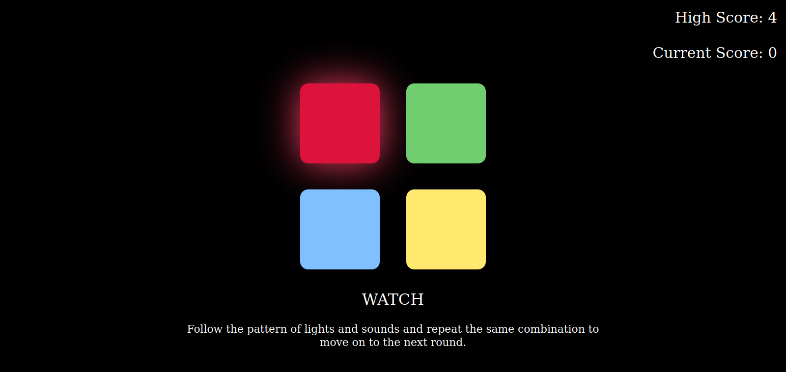
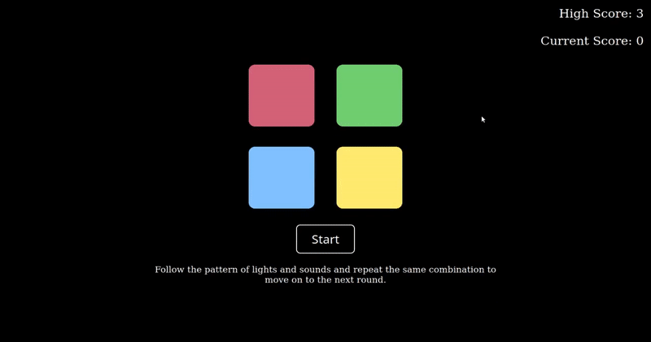

# Echo

## What is Echo exactly?

A clone of the classic board game Simon&trade;, Echo, is a sequence matching memory game thats sure to kill some boredom when you just need some simple 
mindless entertainment.  

## Ok cool, where can i play?

You can click [here](https://cr-booker.github.io/Echo/) to play. 

## Gotcha. How do I play? What are the rules? 

  
Good question, Echo is a simple game.   
The player watches the sequence the game generates and attempts to repeat (echo) the sequence correctly.  
Get it right, you move on to the next round.

Get it wrong and your family will abandon you, your friends will gossip behind you back  
& your enemies will take immense pleasure in your defeat.  
Also, you'll have to start over, lame.

You dont beat Echo, much like life, you just try to do a little better.

## Can you give me cheats codes for the game?

Yes, but they'll turn off in-game achievements.

## How do i get started working on this?
Feel like doing some tinkering? Getting setup is super easy.  

1. Clone this project  
   `https://github.com/syst3m-failur3/Furusato-restaurant-page.git`

1. Ok great you cloned the project, kudos! Now we gotta install the requred dependecies using:  
   `npm install`

1. Finally, to get the bundled files for distrubution we just run:  
   `npm run build`

## License

Echo is available under the GNU General Public License v3 (GPLv3)  
Click [here](https://github.com/cr-booker/Echo/blob/main/LICENSE) for more details.

